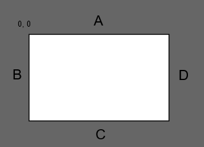

# Procedurally Generated Map in JavaScript

## Definitions
 * Maps are consisted of connected rooms
 * Rooms are sizeable spaces in maps
 * Cooridors connect rooms

## Rules
 * Each room and cooridor must be pathable
 * Maps should have 1 to 5 rooms
 * Rooms should be at least 6 x 6 tiles in size
 * Rooms should not be larger then 50% of map size
 * Rooms should have a size ratio not greater than 1 to 5

## Good cooridors
 * not likely straight
 * should be efficient
 * should not connect too close to corner
 * could use pathfinding

## Room Connection Points

Instead of evaluating connecting to the entire pixel count of the line, we will have connection points, spaced out twice the distance as a path.

 * Line A: Y = 0, X = 0 to Width
 * Line B: X = 0, Y = 0 to Height
 * Line C: Y = Height, X = 0 to Width
 * Line D: X - Width, Y = 0 to Height
 

